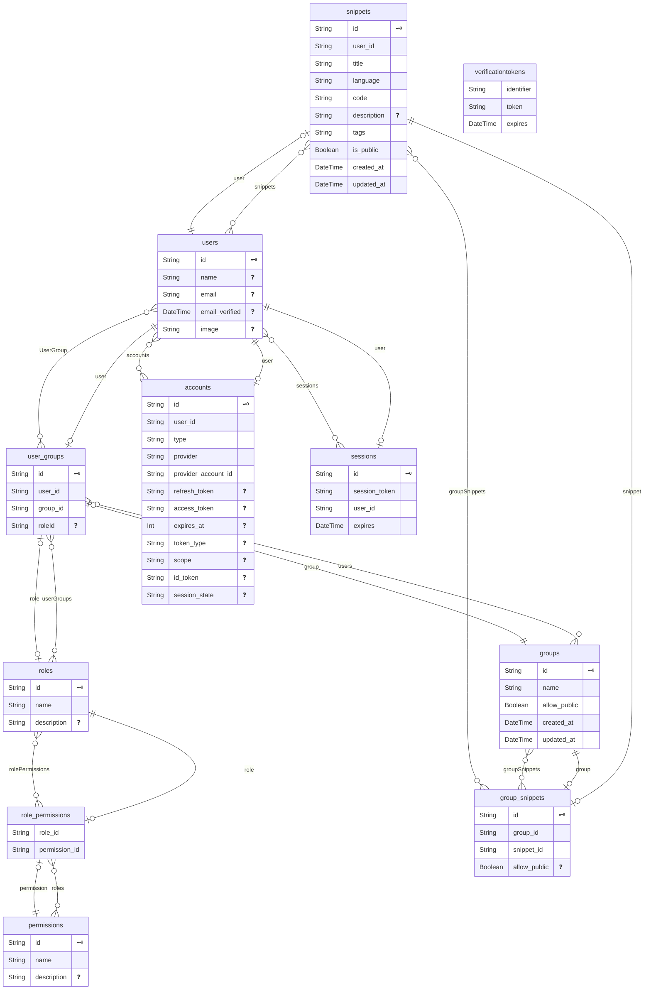

```mermaid
erDiagram

  "snippets" {
    String id "🗝️"
    String user_id 
    String title 
    String language 
    String code 
    String description "❓"
    String tags 
    Boolean is_public 
    DateTime created_at 
    DateTime updated_at 
    }
  

  "permissions" {
    String id "🗝️"
    String name 
    String description "❓"
    }
  

  "roles" {
    String id "🗝️"
    String name 
    String description "❓"
    }
  

  "role_permissions" {
    String role_id 
    String permission_id 
    }
  

  "groups" {
    String id "🗝️"
    String name 
    Boolean allow_public 
    DateTime created_at 
    DateTime updated_at 
    }
  

  "user_groups" {
    String id "🗝️"
    String user_id 
    String group_id 
    String roleId "❓"
    }
  

  "group_snippets" {
    String id "🗝️"
    String group_id 
    String snippet_id 
    Boolean allow_public "❓"
    }
  

  "accounts" {
    String id "🗝️"
    String user_id 
    String type 
    String provider 
    String provider_account_id 
    String refresh_token "❓"
    String access_token "❓"
    Int expires_at "❓"
    String token_type "❓"
    String scope "❓"
    String id_token "❓"
    String session_state "❓"
    }
  

  "sessions" {
    String id "🗝️"
    String session_token 
    String user_id 
    DateTime expires 
    }
  

  "users" {
    String id "🗝️"
    String name "❓"
    String email "❓"
    DateTime email_verified "❓"
    String image "❓"
    }
  

  "verificationtokens" {
    String identifier 
    String token 
    DateTime expires 
    }
  
    "snippets" o|--|| "users" : "user"
    "snippets" o{--}o "group_snippets" : "groupSnippets"
    "permissions" o{--}o "role_permissions" : "roles"
    "roles" o{--}o "user_groups" : "userGroups"
    "roles" o{--}o "role_permissions" : "rolePermissions"
    "role_permissions" o|--|| "roles" : "role"
    "role_permissions" o|--|| "permissions" : "permission"
    "groups" o{--}o "user_groups" : "users"
    "groups" o{--}o "group_snippets" : "groupSnippets"
    "user_groups" o|--|| "users" : "user"
    "user_groups" o|--|| "groups" : "group"
    "user_groups" o|--|o "roles" : "role"
    "group_snippets" o|--|| "groups" : "group"
    "group_snippets" o|--|| "snippets" : "snippet"
    "accounts" o|--|| "users" : "user"
    "sessions" o|--|| "users" : "user"
    "users" o{--}o "accounts" : "accounts"
    "users" o{--}o "sessions" : "sessions"
    "users" o{--}o "snippets" : "snippets"
    "users" o{--}o "user_groups" : "UserGroup"
```
