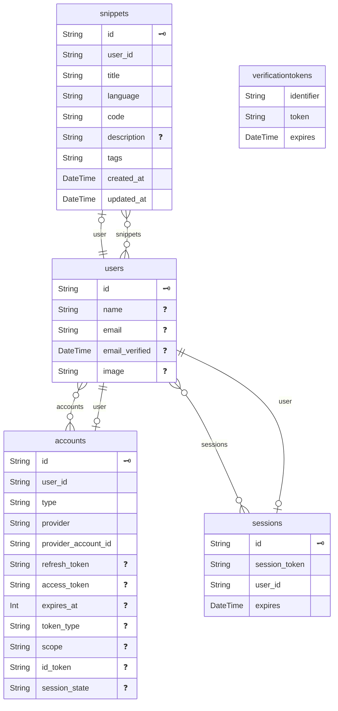

```mermaid
erDiagram

  "snippets" {
    String id "🗝️"
    String user_id
    String title
    String language
    String code
    String description "❓"
    String tags
    DateTime created_at
    DateTime updated_at
    }


  "accounts" {
    String id "🗝️"
    String user_id
    String type
    String provider
    String provider_account_id
    String refresh_token "❓"
    String access_token "❓"
    Int expires_at "❓"
    String token_type "❓"
    String scope "❓"
    String id_token "❓"
    String session_state "❓"
    }


  "sessions" {
    String id "🗝️"
    String session_token
    String user_id
    DateTime expires
    }


  "users" {
    String id "🗝️"
    String name "❓"
    String email "❓"
    DateTime email_verified "❓"
    String image "❓"
    }


  "verificationtokens" {
    String identifier
    String token
    DateTime expires
    }

    "snippets" o|--|| "users" : "user"
    "accounts" o|--|| "users" : "user"
    "sessions" o|--|| "users" : "user"
    "users" o{--}o "accounts" : "accounts"
    "users" o{--}o "sessions" : "sessions"
    "users" o{--}o "snippets" : "snippets"
```
